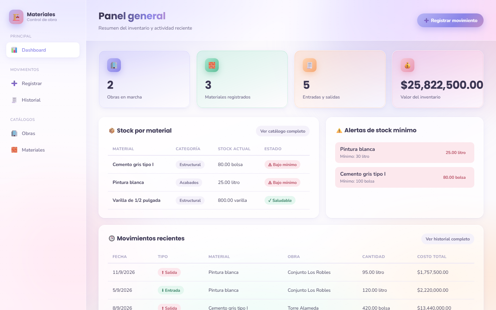
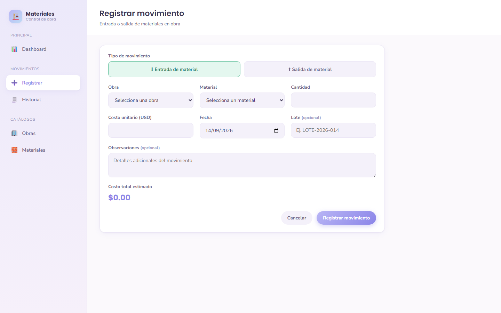
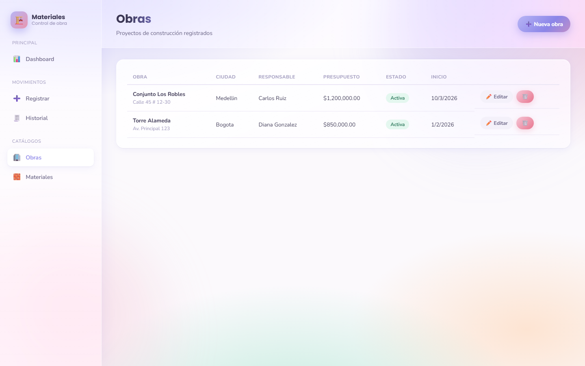
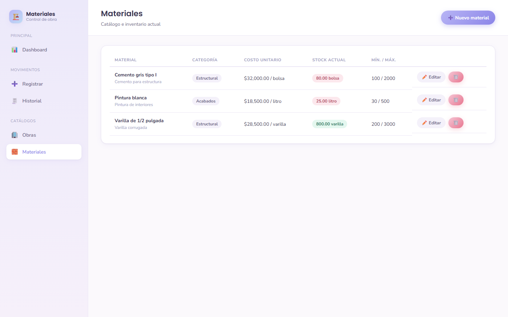
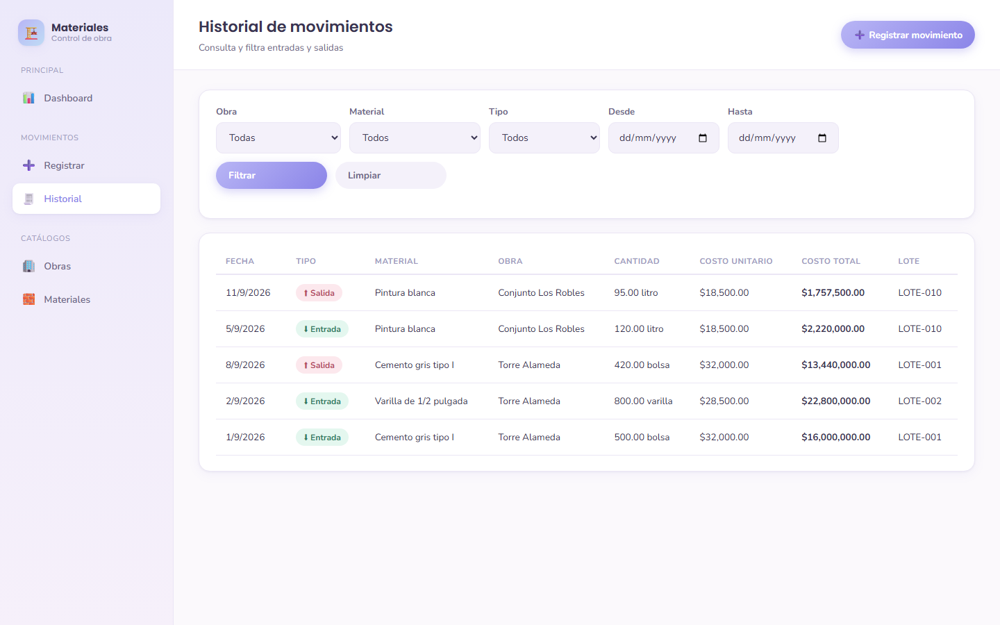
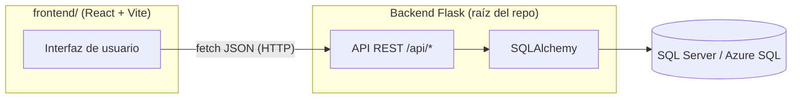
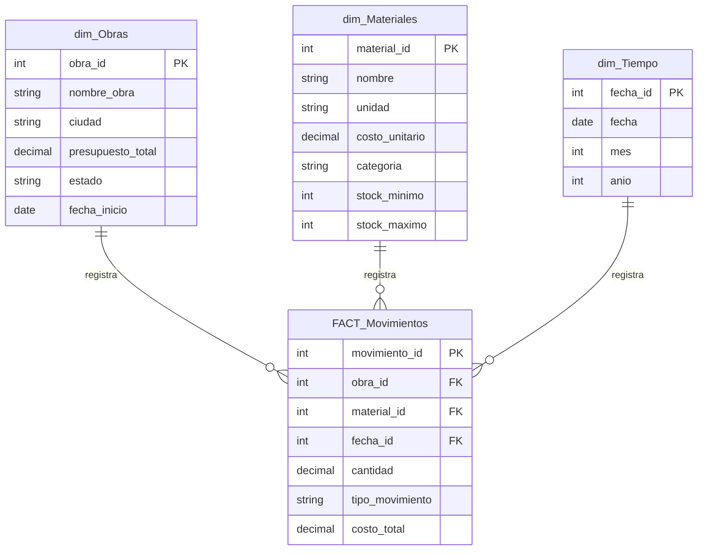

# 🏗️ Gestión de Materiales — Control de Obra

Aplicación web para registrar y controlar las **entradas y salidas de materiales** de una constructora: obras, catálogo de materiales, movimientos de inventario y alertas de stock, con un diseño limpio en tonos pastel.


---

## 📸 Capturas de pantalla

| Dashboard |
|---|
|  |

| Registrar movimiento | Obras |
|---|---|
|  |  |

| Materiales | Historial |
|---|---|
|  |  |

---

## ✨ Funcionalidades

- **Dashboard** con indicadores clave: obras en marcha, materiales registrados, entradas/salidas, valor de inventario y alertas de stock por debajo del mínimo.
- **Registro de movimientos** (entrada/salida) con autocompletado de costo, cálculo de total en vivo y **validación de stock disponible** (no permite sacar más de lo que hay).
- **Catálogo de Obras**: alta, edición y borrado protegido (no se puede eliminar una obra con movimientos ya registrados).
- **Catálogo de Materiales**: unidad de medida, costo unitario, categoría, stock mínimo/máximo.
- **Historial de movimientos** con filtros por obra, material, tipo de movimiento y rango de fechas.
- Preparado para conectarse al mismo modelo de datos que el reporte de **Power BI** (`Modelo_estrella_construccion.pbix`) incluido en el repo.

---

## 🧱 Arquitectura

La aplicación está separada en dos proyectos independientes que se comunican por **API REST (JSON)**:



| Capa | Tecnología |
|---|---|
| Frontend | [React](https://react.dev/) + [Vite](https://vitejs.dev/) + React Router |
| Backend | [Flask](https://flask.palletsprojects.com/) — API REST, sin renderizado de HTML |
| ORM | [SQLAlchemy](https://www.sqlalchemy.org/) / Flask-SQLAlchemy |
| Base de datos | SQL Server (local) o Azure SQL (nube) |
| Driver DB | `pyodbc` (local, autenticación Windows) / `pymssql` (nube, sin dependencias de sistema) |
| Estilos | CSS propio (sistema de diseño pastel, sin frameworks) |
| Despliegue | Vercel (frontend estático + backend serverless) |

---

## 🗂️ Estructura del proyecto

```text
Gestion_de_materiales/
├── app.py                      # Punto de entrada Flask: API + sirve frontend/dist (modo LAN)
├── config.py                   # Configuración y cadena de conexión (local/nube automática)
├── extensions.py               # Instancia de SQLAlchemy
├── models.py                   # Modelos ORM + serialización a JSON (to_dict)
│
├── routes/                     # Blueprints de la API REST (un archivo por recurso)
│   ├── dashboard.py             #   GET /api/dashboard      → KPIs e inventario
│   ├── obras.py                 #   /api/obras              → CRUD de obras
│   ├── materiales.py            #   /api/materiales         → CRUD de materiales
│   └── movimientos.py           #   /api/movimientos        → registrar + listar/filtrar
│
├── scripts/
│   └── init_db.py               # Crea la BD, las tablas y precarga la dimensión de tiempo
│
├── api/                         # Entrada específica para despliegue serverless (Vercel)
│   ├── index.py
│   └── requirements.txt
│
├── frontend/                    # Aplicación React (SPA) — consume la API anterior
│   ├── src/
│   │   ├── api/client.js          # Cliente fetch hacia la API (VITE_API_URL)
│   │   ├── components/            # Sidebar, Layout, Flash (mensajes)
│   │   ├── pages/                 # Dashboard, Obras, Materiales, Movimientos, formularios
│   │   └── styles/style.css       # Sistema de diseño pastel (paleta, componentes)
│   ├── index.html
│   └── package.json
│
├── Gestion_de_materiales.sql   # Script original del modelo en estrella (SQL Server)
├── Modelo_estrella_construccion.pbix   # Reporte Power BI sobre el mismo modelo
├── requirements.txt             # Dependencias del backend para desarrollo local
├── vercel.json                  # Configuración de despliegue serverless del backend
├── .env.example                  # Plantilla de variables de entorno del backend
└── .gitignore
```

---

## 🧩 Modelo de datos

La base sigue un **modelo en estrella**: una tabla de hechos (`FACT_Movimientos`) conectada a tres dimensiones.



El **stock actual** de cada material se calcula sumando entradas y restando salidas de `FACT_Movimientos` — no se guarda como un número fijo, así siempre queda consistente con el historial.

---

## 🔌 Endpoints de la API

| Método | Ruta | Descripción |
|---|---|---|
| GET | `/api/dashboard` | KPIs, inventario, alertas y movimientos recientes |
| GET / POST | `/api/obras` | Listar / crear obras |
| GET / PUT / DELETE | `/api/obras/<id>` | Ver, editar o eliminar una obra |
| GET / POST | `/api/materiales` | Listar (con stock actual) / crear materiales |
| GET / PUT / DELETE | `/api/materiales/<id>` | Ver, editar o eliminar un material |
| GET | `/api/movimientos` | Historial con filtros: `obra_id`, `material_id`, `tipo`, `desde`, `hasta` |
| POST | `/api/movimientos` | Registrar entrada/salida (valida stock disponible) |

---

## ⚙️ Cómo correrlo en tu máquina

### Requisitos previos

- Python 3.11+ y Node.js 18+
- SQL Server (Express sirve) corriendo localmente
- [ODBC Driver 17 o 18 para SQL Server](https://learn.microsoft.com/sql/connect/odbc/download-odbc-driver-for-sql-server) instalado

### 1. Backend (API Flask)

```bash
git clone https://github.com/Diana1295Dev/Gestion-materiales-construccion.git
cd Gestion-materiales-construccion

python -m venv venv
venv\Scripts\activate          # En Windows
pip install -r requirements.txt

copy .env.example .env
# Ajusta DB_SERVER en .env si tu instancia no se llama "localhost\SQLEXPRESS"

python scripts\init_db.py      # Crea la base de datos y las tablas
python app.py                  # Levanta la API en http://127.0.0.1:5000
```

### 2. Frontend (React)

En otra terminal:

```bash
cd frontend
npm install
copy .env.example .env         # Ya apunta a http://127.0.0.1:5000/api
npm run dev                    # Levanta la app en http://localhost:5173
```

Abre **http://localhost:5173** en tu navegador. 🎉

---

## 🏠 Opción sin nube: uso en red local (LAN)

Si la app la va a usar solo el equipo de una oficina/obra (todos conectados al mismo WiFi), **no necesitas nube ni Azure SQL**. Todo corre en un solo computador: la base de datos, el backend y el frontend ya compilado, servidos por un único proceso Flask.

```bash
# 1. Compila el frontend una sola vez
cd frontend
npm install
npm run build
cd ..

# 2. Corre el backend (ya sirve la API Y la interfaz compilada)
python app.py
```

Verás en la consola algo como `Running on http://192.168.x.x:5000` — esa es la IP de tu PC en la red local (también puedes verla con `ipconfig` en Windows, buscando "Dirección IPv4").

Desde **cualquier otro computador o celular conectado al mismo WiFi**, abre esa dirección en el navegador, por ejemplo:

```
http://192.168.1.50:5000
```

**Ventajas:** cero costo, cero configuración externa, tus datos nunca salen de tu red.
**Limitaciones:** el PC que corre `python app.py` debe estar encendido para que los demás accedan; solo funciona dentro de la misma red (no accesible desde fuera de la oficina); Windows puede pedir permiso de Firewall la primera vez — debes aceptarlo para que otros equipos se puedan conectar.

---

## ☁️ Despliegue en la nube

En ambos casos, el backend y el frontend se despliegan como **dos servicios separados**, y ambos requieren una base de datos accesible desde internet — **Azure SQL Database** (capa gratuita disponible), mismo motor SQL Server, compatible con Power BI.

`config.py` detecta automáticamente el entorno: si existen `DB_USER` y `DB_PASSWORD`, usa autenticación SQL vía `pymssql` (nube); si no, usa autenticación de Windows vía `pyodbc` (local). No hay que tocar código al cambiar de entorno.

### Opción A — Vercel (serverless)

1. **Backend**: proyecto Vercel apuntando a la raíz del repo → usa `api/index.py` + `vercel.json`.
2. **Frontend**: proyecto Vercel apuntando a la carpeta `frontend/` → Vercel detecta Vite automáticamente.

### Opción B — Render (servidor persistente, recomendado para el backend)

1. **Backend** → "Web Service" en Render, apuntando a la raíz del repo:
   - Build Command: `pip install -r api/requirements.txt`
   - Start Command: `gunicorn app:app`
2. **Frontend** → "Static Site" en Render, apuntando a la carpeta `frontend/`:
   - Build Command: `npm install && npm run build`
   - Publish Directory: `dist`

### Variables de entorno (en el dashboard de la plataforma, nunca en el repositorio)

| Servicio | Variable | Valor |
|---|---|---|
| Backend | `DB_SERVER`, `DB_NAME`, `DB_USER`, `DB_PASSWORD` | Credenciales de Azure SQL |
| Backend | `CORS_ORIGINS` | URL pública del frontend desplegado |
| Frontend | `VITE_API_URL` | URL pública del backend desplegado + `/api` |

---

## 🗺️ Próximos pasos sugeridos

- [ ] Gráficos de consumo de materiales por obra
- [ ] Comparativo presupuesto vs. gastado por obra
- [ ] Exportar reportes a Excel/PDF
- [ ] Autenticación de usuarios (login)
